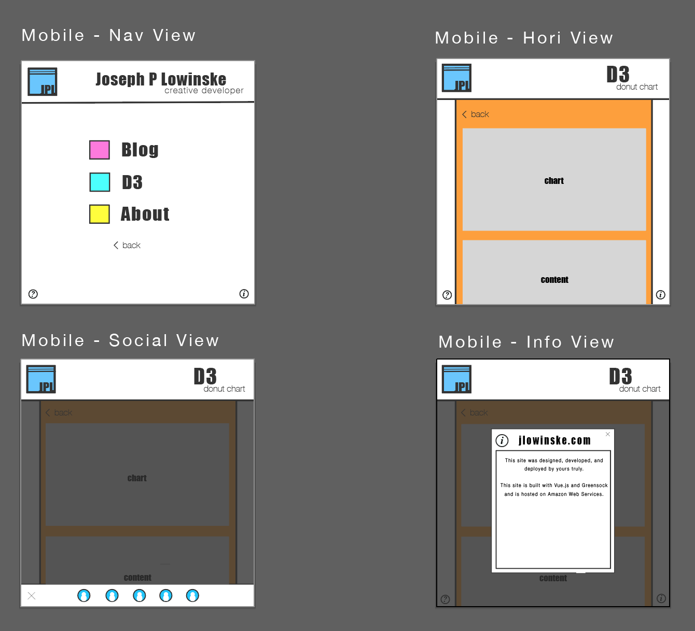

# Responsiveness Demo
  I did some basic reconfiguring to give a sense of my basic approach to responsive, mobile-first design.  [The live version can be viewed here.](http://jlowinske.com/#/d3/donut)
## Notes
* I implemented two basic layouts: mobile and browser; under normal circumstances and depending upon the requirements for content display I would likely use more than two basic layouts
* I did this in a mobile-first fashion by defining the basic CSS classes to handle the mobile case and using a media query wrapper set at `min-width: 1024px` for handling browser layouts (i.e. mobile is the default case and desktop browsing is the special case, not the other way around).
* The layout isn't perfect.  There are some additional things that I will be doing when I take this work forward and implement the responsiveness on the full site.  Specifically:
  - the social icons will be accessible in a clickable footer (not just hidden)
  - primary content will be reworked to handle changing resolutions and screen sizes (e.g. the donut chart itself should resize on when it's container is resized or the resolution changes but this handling is non-trivial so it was not added as part of the work for this demo)
  - SVG headers need to be adjusted so that the render slightly differently depending on the layout (i.e. 'D3 donut chart' does not render fully to the right edge of the header in the mobile view because this breaks the layout in a way that requires refactoring of the SVG itself which is also non-trivial but will be done in the full-scale refactor)
* Below is a screenshot of wireframes illustrating the planned look of the remaining mobile views

